```{r setup, include=FALSE}
options(htmltools.dir.version = FALSE)
knitr::opts_chunk$set(
  fig.width=9, fig.height=3.5, fig.retina=3,
  out.width = "100%",
  cache = FALSE,
  echo = TRUE,
  message = FALSE, 
  warning = FALSE,
  hiline = TRUE
)

library(xaringanthemer)
library(xaringanExtra)
library(showtext)
library(fontawesome)
library(metathis)
library(tidyverse)
```

```{r xaringan-themer, include=FALSE, warning=FALSE}
style_duo_accent(
  header_font_google = google_font("News Cycle"),
  text_font_google   = google_font("Dosis", "300", "300i"),
  code_font_google   = google_font("Fira Mono")
)
```

```{r xaringan-extras, echo=FALSE}
xaringanExtra::use_scribble()
xaringanExtra::use_panelset()
xaringanExtra::use_clipboard()
```

```{r metathis, echo=FALSE}
meta() %>%
  meta_name("github-repo" = "shaziaruybal/automate-cv-rmd") %>% 
  meta_social(
    title = "Automate your CV using R Markdown: Easy as 1, 2, knit!",
    description = paste(
      "A workshop that will show you how to get from data to professional CV using R Markdown.",
      "Presented at the R-Ladies Melbourne meetup February 2022."
    ),
    url = "https://shaziaruybal.github.io/automate-cv-rmd/",
    image = "https://shaziaruybal.github.io/automate-cv-rmd/img/social-share-card.png",
    image_alt = paste(
      "Title slide of Automate your CV using R Markdown: Easy as 1, 2, knit!", 
      "presented at the R-Ladies Melbourne meetup February 2022 by Shazia Ruybal-Pesántez"
    ),
    og_type = "website",
    og_author = "Shazia Ruybal-Pesántez",
    twitter_card_type = "summary_large_image",
    twitter_creator = "@DrShaziaRuybal",
    twitter_site = "@DrShaziaRuybal"
  )
```

class: title-slide, bottom,center
background-image: url(img/title_bkgd.png)
background-position: top center
background-size: 100%

## `r rmarkdown::metadata$title`

### `r rmarkdown::metadata$author`  
`r rmarkdown::metadata$institute`

`r rmarkdown::metadata$date`

[`r fa(name = "github")` @shaziaruybal](http://github.com/shaziaruybal)  
[`r fa(name = "twitter")` @DrShaziaRuybal](http://twitter.com/DrShaziaRuybal)  
[`r fa(name = "link")` shaziaruybal.com](https://shaziaruybal.com)  

.pull-right[

]

---
name: about-me
class: middle, center, inverse

# About me


### Shazia Ruybal-Pesántez 
#### Postdoctoral Research Scientist & R-Ladies Melbourne President

[`r fa(name = "github")` @shaziaruybal](http://github.com/shaziaruybal)  
[`r fa(name = "twitter")` @DrShaziaRuybal](http://twitter.com/DrShaziaRuybal)  
[`r fa(name = "link")` shaziaruybal.com](https://shaziaruybal.com)

---
layout: true

<!--this adds the repo link footer to all slides, depends on footer-link class in custom.css-->

<a class="footer-link" href="https://github.com/shaziaruybal.com/automate-cv-rmd"><strong><i class="fab fa-github"></i> automate-cv-rmd</strong>
&#8226; <i class="fab fa-twitter"></i>@DrShaziaRuybal </a>

---
name: welcometoR
background-image: url("img/welcome_to_rstats_twitter.png")
background-size: contain
background-position: middle

.footnote[
*Art by [@alison_horst](https://github.com/allisonhorst/stats-illustrations)*
]

---
class: center, middle

# Let's get to know each other

--
## 👍 if you consider yourself an `R` and/or `R Markdown` beginner

--
## ❤️ if you are comfortable or very comfortable with `R` and `R Markdown`

---

class: inverse, center
# `r fontawesome::fa("chalkboard")`
# Today we will cover:

--
### How to get from data to professional CV using `rmarkdown`

--
### Workshop materials are freely available and should help you get started on your own CV journey!

--

.left-column[
.pull-left[
### [`r icon::fa("github")` Materials](https://github.com/shaziaruybal/automate-cv-rmd)
]]

.right-column[

.pull-left[

### [`r icon::fa("images")` Slides](http://shaziaruybal.github.io/automate-cv-rmd) 
]

.pull-right[
### [`r icon::fa("youtube")` Recording](https://youtu.be/Fc1RwRskk08) 
]

]

---

background-image: url(https://github.com/allisonhorst/stats-illustrations/raw/master/rstats-artwork/rmarkdown_wizards.png)
background-size: 85% 85%
background-position: center

.footnote[
*Art by [@alison_horst](https://github.com/allisonhorst/stats-illustrations)*
]
---
name: packages

# Meet your new best friends 

.left-column[
 

 


]

--

.right-column[
#### `datadrivencv` developed by Nick Strayer
[`r icon::fa("github")` Github repo](https://github.com/nstrayer/datadrivencv)
[`r icon::fa("globe")` Package documentation](http://nickstrayer.me/datadrivencv/)
]

--
.right-column[
#### `pagedown` developed by Yihue Xie and Romain Lesur
[`r icon::fa("github")` Github repo](https://github.com/rstudio/pagedown)
[`r icon::fa("globe")` Package documentation](https://pagedown.rbind.io/#resume)
]

--

.right-column[
#### `vitae` developed by Mitchell O'Hara-Wild and Rob Hyndman
[`r icon::fa("github")` Github repo](https://github.com/mitchelloharawild/vitae)
[`r icon::fa("globe")` Package documentation](https://pkg.mitchelloharawild.com/vitae/)
]

---

# Disclaimer:
- I am assuming familiarity with R Markdown, for beginners see the [`R Markdown` resources](#rmd-tips) on the next slide
  
- The `datadrivencv` package uses `pagedown` and creates useful functions to import and build your CV, so I won't go over `pagedown` specifically in this talk

- but `pagedown` gets a special shoutout because it is an amazing package - you can also use it to generate all kinds of outputs, e.g. resumes, posters, thesis, letter, journal article and more!
  - See the [pagedown package documentation](https://pagedown.rbind.io) for more details

- To prepare this workshop, I went step-by-step to create a CV in `datadrivencv` and `vitae` so I could provide a demo for all of you.

--
  - `vitae` was easier to use and implement, if you are a beginner I would recommend using `vitae`. 

  - The materials and slides for this workshop can be found at [github.com/shaziaruybal/automate-cv-rmd](https://github.com/shaziaruybal/automate-cv-rmd) so feel free to come back to them on your own time. This includes the debugging steps that are necessary to get `datadrivencv` to build. The recording of the talk is on [`r icon::fa("youtube")` Youtube](https://youtu.be/Fc1RwRskk08).

---
class: inverse, top
name: rmd-tips

# Unfamiliar with R Markdown?

### [A good start here ⬇️](https://rmarkdown.rstudio.com/lesson-1.html) 
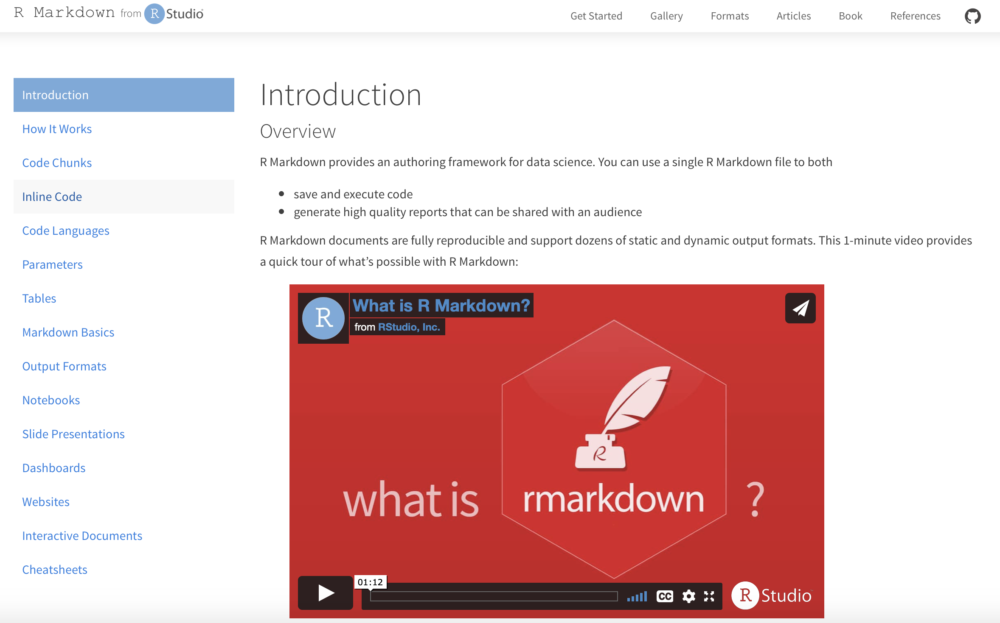


---

class: inverse, center, middle

# Let's dive straight in


---

class: inverse, center, middle

# Meet Kate Dibiasky
-----


---

class: left, inverse

# Meet Kate Dibiasky
-----
.left-column[
### `r fontawesome::fa("film")`
### `r fontawesome::fa("graduation-cap")`
### `r fontawesome::fa("meteor", fill = "white")`
]
.right-column[
### Fictional character in the Netflix movie "Don't Look Up" 
### PhD candidate at Michigan State University
### Claim to fame: comet discovery 
]

---
class: middle, left, inverse
background-image: url(img/kate_vitae.png)
background-size: contain

.left-column[
# This is her CV using `vitae`
]
<!-- 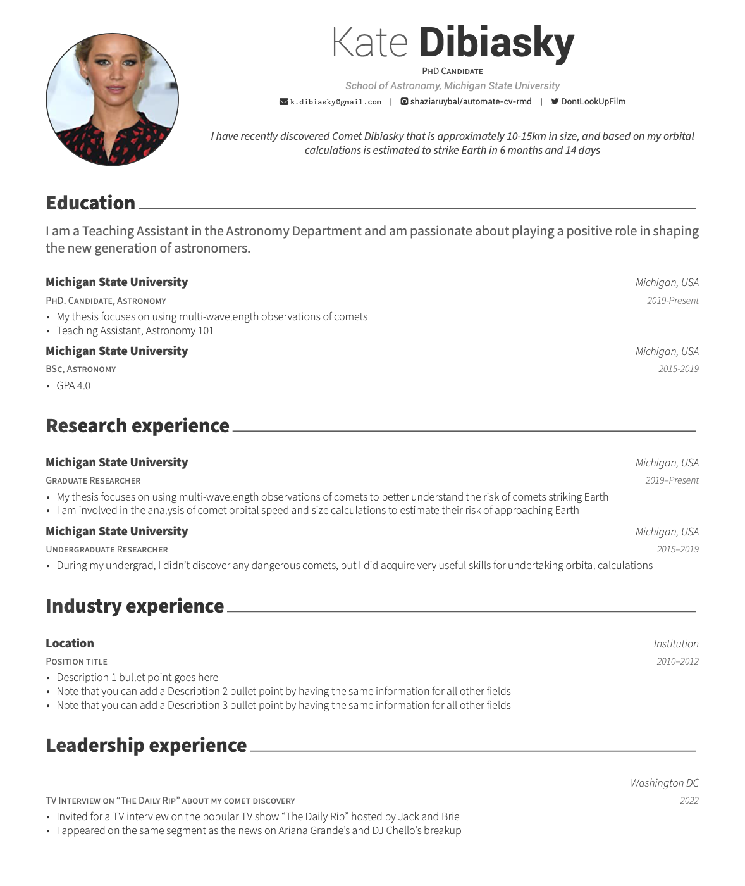 -->


---
class: middle, left, inverse
background-image: url(img/kate_ddcv.png)
background-size: contain

.left-column[
# This is her CV using `datadrivencv`
]
<!-- 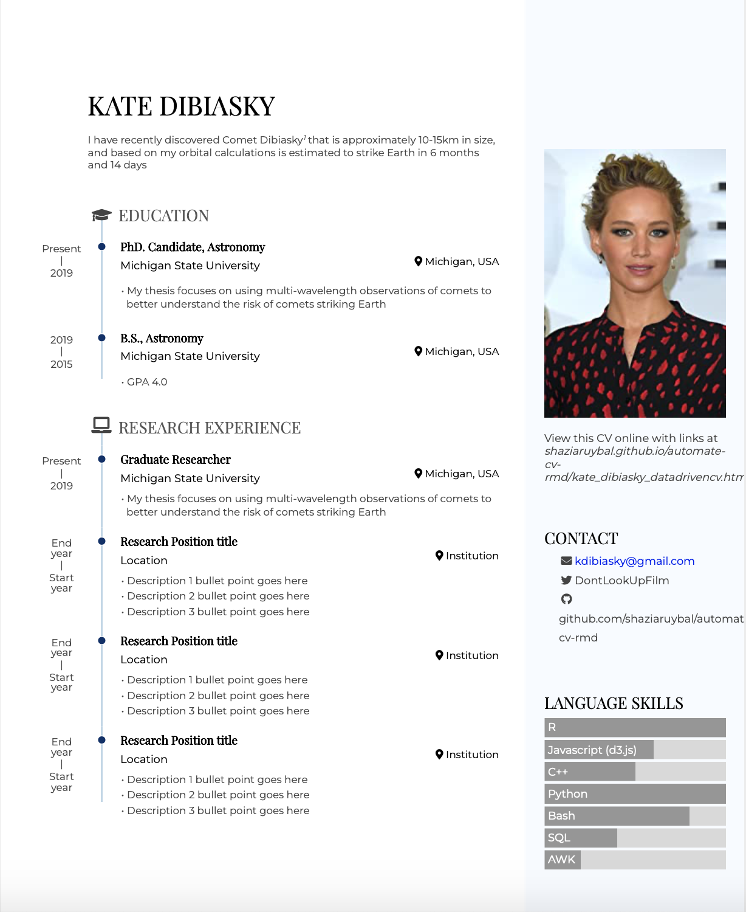 -->

---
class: inverse, center, middle

# Let's show you how to make your CV look like that 😍


--
## 🎉 if you prefer the `vitae` CV format
  
--
## ❤️ if you prefer the `datadrivencv`/`pagedown` CV format
  
---
class: center, middle

# `vitae`


---

name: data-vit-1
class: inverse

# Step 1: Prepare your data

### You can save all your data in one excel file, where each sheet is a different section of your CV

--
### Common sections include:

* Education
* Research
* Teaching
* Leadership
* Awards

--

### The example data from today's workshop can be viewed at  [github.com/shaziaruybal/automate-cv-rmd](https://github.com/shaziaruybal/automate-cv-rmd/blob/main/kate_dibiasky_vitae_cv/dibiasky_vitae_data.xlsx)

---
name: data-vit-2
class: inverse

# Step 1: Prepare your data: The 4 W's

### Every section can be built with the same base information:

--
#### `r fontawesome::fa("question-circle")` What?
E.g. your role or an award you've received

--
#### `r fontawesome::fa("building")` With?
E.g. your institute or employer

--
#### `r fontawesome::fa("map-marker-alt")` Where?
E.g. city or country

--
#### `r fontawesome::fa("question-circle")` Why?
E.g. the details of your role or award

---
name: data-vit-3
class: inverse

# Step 1: Prepare your data

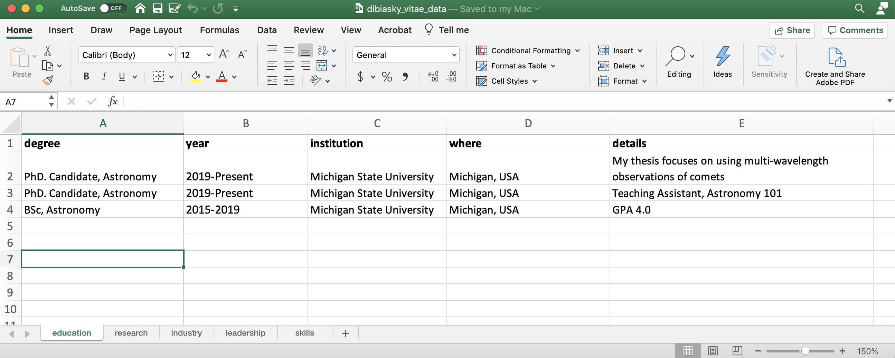

--
For the education section we use "degree" for the "what"

---
name: data-vit-4
class: inverse

# Step 1: Prepare your data

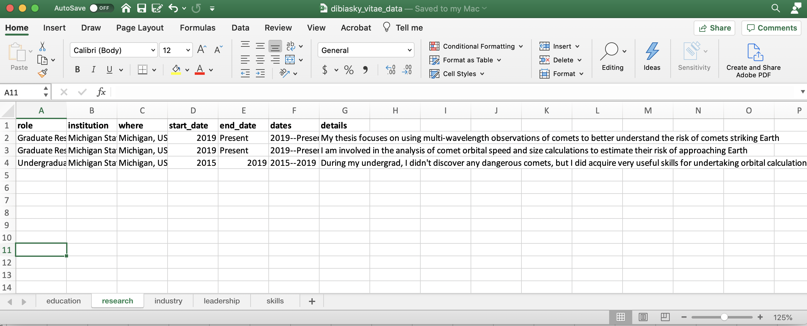

--
For the research section we use "role" for the "what". 

--
**`r fontawesome::fa("lightbulb")` Tip: ** If you want more than one bullet point for the role description, use another line and change "details". 

---
# Step 2: Start building your CV in `vitae`

.pull-left[
Install the `vitae` package
```{r eval=F}
install.packages("vitae")
```

*Note: this package requires LaTeX to be installed on your computer. If you’re encountering issues, run:*

```{r eval=F}
install.packages("tinytex")
tinytex::install_tinytex()
```


In the RStudio IDE, create a new R Markdown document from the menu `File -> New File -> R Markdown -> From Template`
]

.pull-right[
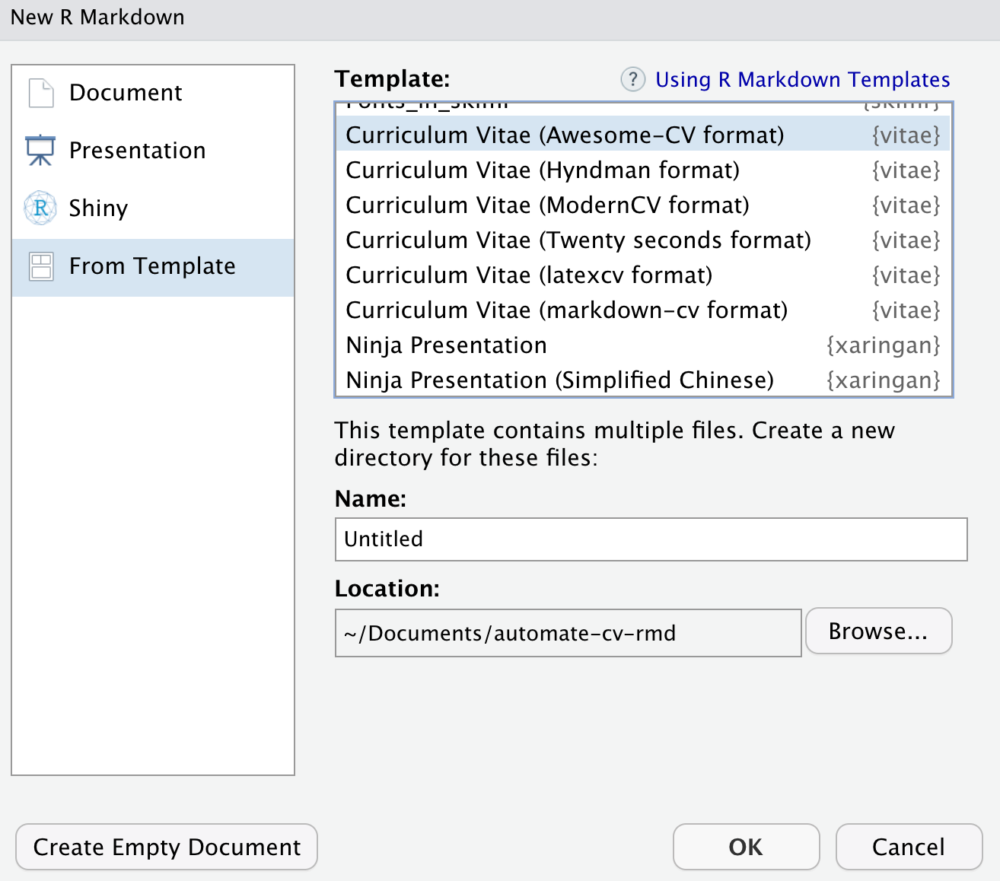
]
---
class: inverse, center, middle
# 👀 What are all those templates? 

--

### Today we will only go through the `vitae::awesomecv` template, but the world is your oyster! There are currently 6 templates for you to choose from. Take a look at them at [github.com/mitchelloharawild/vitae](https://github.com/mitchelloharawild/vitae). 

<!-- {width="40px" height="20px"} -->


---

class: inverse, center


--
# Wasn't this supposed to be easy as 1, 2, `knit`?

--
{height="80%"}
---
class: top, center

<video width="1530" height="610" controls>
  <source src="img/vitae-1-2-knit.mp4" type="video/mp4"> 
</video>

---
class: right, center, inverse

# Now you've seen that it really is as easy as 1, 2 `knit`! 

# Let's create Kate's CV together 

.pull-right[

]

---
# `r fontawesome::fa("x-ray")` The anatomy of the `vitae` CV .Rmd

.pull-left[
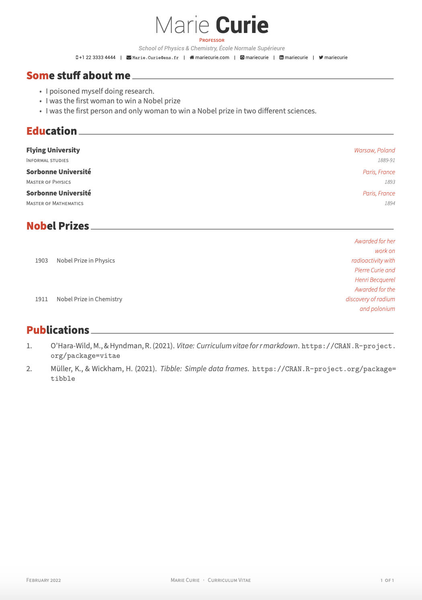
]

.pull-right[


**Header** 

- Main contact information (controlled by the YAML)

**Bio**

- Optional bio (written in R Markdown)

** CV sections**

- These sections will be tailored to the sections you want to include (remember our .xlsx sheets)
- These sections are built with the `vitae::detailed_entries()` or `vitae::brief_entries()`
]

---
class: inverse, center, middle

# Let's start with the YAML header

---
# Step 3: Change the CV content: header

.pull-left[
## YAML
This controls the CV header.
```{r eval=F}
---
name: Marie
surname: Curie
position: "Professor"
address: "School of Physics & Chemistry, École Normale Supérieure"
phone: +1 22 3333 4444
www: mariecurie.com
email: "Marie.Curie@ens.fr"
twitter: mariecurie
github: mariecurie
linkedin: mariecurie
date: "`r format(Sys.time(), '%B %Y')`"
output: 
  vitae::awesomecv:
    page_total: true
---
```
]

.pull-right[

]

---
# Step 3: Change the CV content: header 

.panelset.sideways[
.panel[.panel-name[Change the YAML]

Change the content to suit your needs
```{r eval=F}
---
name: Kate
surname: Dibiasky
position: "PhD Candidate"
address: "School of Astronomy, Michigan State University"
# phone: +1 22 3333 4444
# www: mariecurie.com
email: "k.dibiasky@gmail.com"
twitter: DontLookUpFilm
github: shaziaruybal/automate-cv-rmd
# linkedin: mariecurie
date: "`r format(Sys.time(), '%B %Y')`"
output: 
  vitae::awesomecv:
    page_total: true
---
```

**`r fontawesome::fa("lightbulb")` Tip: ** Use the `#` to comment out anything you don't want in your header
]

.panel[.panel-name[Output]
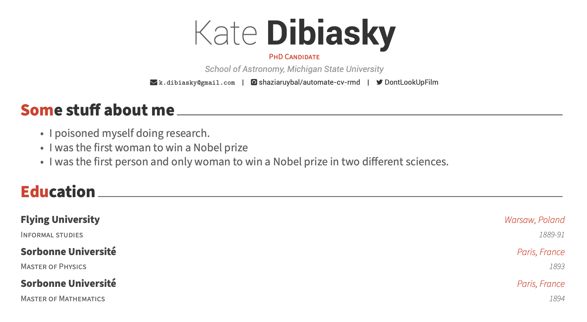
]

.panel[.panel-name[Add a profile pic]
```{r eval=F}
---
name: Kate
surname: Dibiasky
position: "PhD Candidate"
profilepic: "img/kate.jpeg" #<<
address: "School of Astronomy, Michigan State University"
# phone: +1 22 3333 4444
# www: mariecurie.com
email: "k.dibiasky@gmail.com"
twitter: DontLookUpFilm
github: shaziaruybal/automate-cv-rmd
# linkedin: mariecurie
date: "`r format(Sys.time(), '%B %Y')`"
output: 
  vitae::awesomecv:
    page_total: true
---
```
]

.panel[.panel-name[Output]
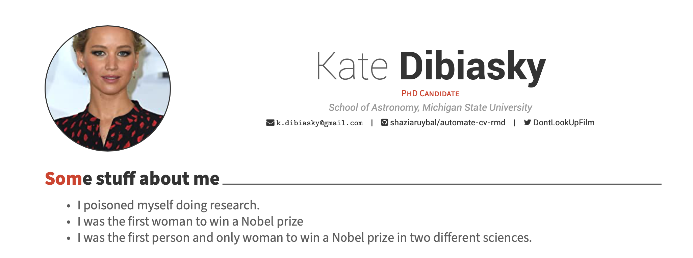
]

.panel[.panel-name[Add an about me]

Add an about me that will appear just below your contact info. 
```{r eval=F}
---
name: Kate
surname: Dibiasky
position: "PhD Candidate"
profilepic: "img/kate.jpeg"
address: "School of Astronomy, Michigan State University"
# phone: +1 22 3333 4444
# www: mariecurie.com
email: "k.dibiasky@gmail.com"
twitter: DontLookUpFilm
github: shaziaruybal/automate-cv-rmd
# linkedin: mariecurie 
aboutme: "I have recently discovered Comet Dibiasky that is approximately #<<
10-15km in size, and based on my orbital calculations is estimated to strike #<<
Earth in 6 months and 14 days" #<<
date: "`r format(Sys.time(), '%B %Y')`"
output: 
  vitae::awesomecv:
    page_total: true
---
```

]

.panel[.panel-name[Output]
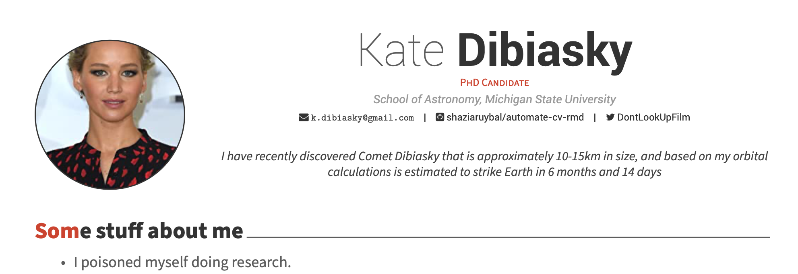
]

.panel[.panel-name[`r fontawesome::fa("lightbulb")` Tips]

- You can also include things like `orcid` and `googlescholar` in your YAML
- Whatever text goes in `name` will be light (so if you don't want your last name to be bold, put your full name here)
- Whatever text goes in `surname` will be bold (so if you want your name to be bold, put your full name here)
- While I won't get into CSS today, you can change the CV accent color (currently red) by playing around with the `awesome-cv.cls` document where colors are defined (look from line 122)
  - If you want to remove the accent color altogether, include the following in your YAML:

```{r eval=F}
headcolor: 414141
```

]

]

---
# Step 4: Load your CV data


### Let's load our .xlsx file so we can update the content of each section. 

--

I've written a simple function `readExcelSheets` to read all the sheets in an .xlsx and save them as individual data frames for each CV section. This makes it super easy to load your data. 

--

The function is below, feel free to use it in your own CV .Rmd. Make sure you have installed the `readxl` package.
```{r eval=F}
# install.packages("readxl") uncomment this if you need to install the package
library(readxl)

readExcelSheets <- function(filename){
  # read all sheets in .xlsx 
  all <- readxl::excel_sheets(filename)
  
  # import each sheet into a list using readxl::read_excel
  list <- lapply(all, function(x) readxl::read_excel(filename, sheet = x))
  
  # save sheet name for each sheet (list)
  names(list) <- all
  
  # breaks up list and creates a dataframe for each sheet with df names matching sheet names
  list2env(list, envir = .GlobalEnv)
}
```

---
.pull-left[
### Let's load our .xlsx file so we can update the content of each section. 

Now we can apply the function to our .xlsx file.
```{r eval=F}
filename <- here::here("kate_dibiasky_vitae_cv", 
                       "dibiasky_vitae_data.xlsx")

readExcelSheets(filename)
```

*If you've never heard of the `here` package I **highly** recommend it! [More info here](https://here.r-lib.org)*
]


.pull-right[
This will result in a data frame for each sheet in your .xlsx file, i.e. each CV section.

From these sheets:

To these data frames:
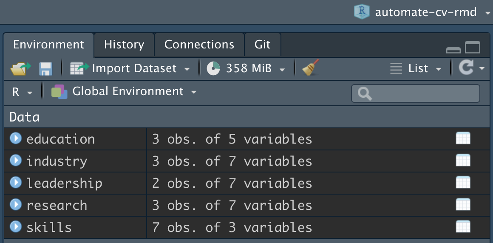

*Note: you can also have each section in its own .csv file and you would then load each .csv separately.* 
]

---
class: inverse

# `r fontawesome::fa("graduation-cap")` Let's create the Education section as an example

.panelset.sideways[
.panel[.panel-name[CV entries]

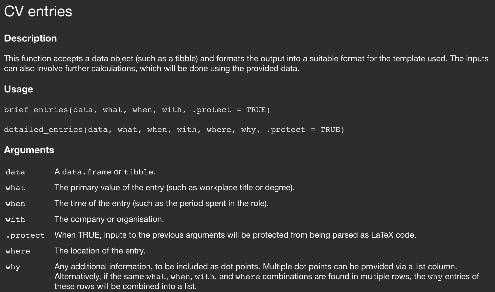

]
.panel[.panel-name[Default code]

The default template has the following code, which creates the data frame/tribble directly in the script. You can choose this option if you like, although this is not my personal preference. If you're still with me, we now have our `education` dataframe that we can pipe with `detailed_entries()`.
```{r eval=F}
library(tibble) #<<
tribble( #<<
  ~ Degree, ~ Year, ~ Institution, ~ Where, #<<
  "Informal studies", "1889-91", "Flying University", "Warsaw, Poland", #<<
  "Master of Physics", "1893", "Sorbonne Université", "Paris, France", #<<
  "Master of Mathematics", "1894", "Sorbonne Université", "Paris, France" #<<
) %>% 
  detailed_entries(Degree, Year, Institution, Where)
```
]

.panel[.panel-name[Our code]

Our education data frame looks like:
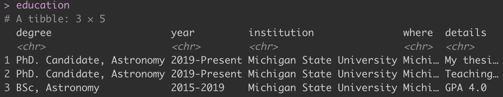

To create the CV section:
```{r eval=F}
education %>% 
  detailed_entries(what = degree,
                   when = year,
                   with = institution,
                   where = where,
                   why = details)
```
]

.panel[.panel-name[Output]
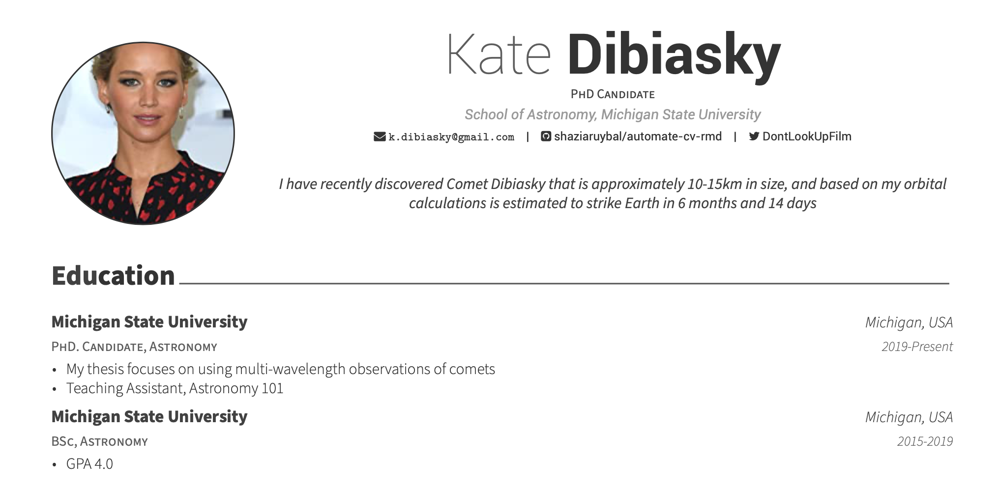
]
]

---
# `r fontawesome::fa("book")` What about publications?

.panelset.sideways[

.panel[.panel-name[Using a bibtex file]

- Download your .bib file from your favorite reference manager 
- Use `vitae::bibliography_entries` for publications in your CV

Code:
```{r eval=F}
bibliography_entries(here("kate_dibiasky_vitae_cv", "papers.bib")) 
```

[You can find the demo .bib file here](https://github.com/shaziaruybal/automate-cv-rmd/blob/main/kate_dibiasky_vitae_cv/papers.bib)

]

.panel[.panel-name[Output]
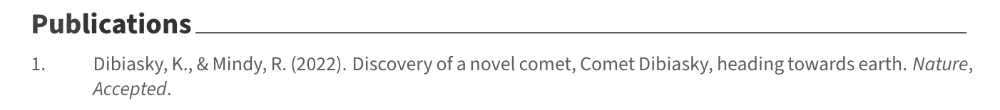
]

.panel[.panel-name[R Markdown + Latex]
- If you know Latex, you can use latex commands directly in your file, e.g. for formatting.
- You can also use R Markdown syntax anywhere on your document

Code:
```{r eval=F}
## Another way to display publications is using R Markdown. You can also use latex commands throughout the document:

\setlength{\leftskip}{0cm}

**2022**

\setlength{\leftskip}{1cm}
[**Dibiasky, K.** and Mindy, R. (2022). *Discovery of a novel comet, Comet Dibiasky, heading towards Earth.* Science.](https://media.giphy.com/media/q9CS6tp1oM45pmj19U/giphy.gif) 

```

]

.panel[.panel-name[Output]
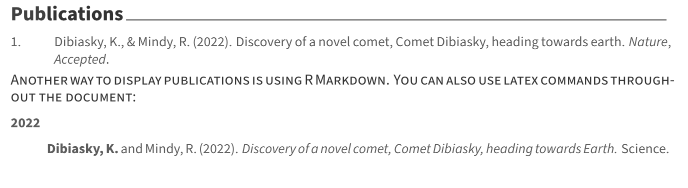

]

.panel[.panel-name[`r fontawesome::fa("lightbulb")` Tips]

- You can use R Markdown syntax in your .xlsx file and it will print in your CV
  - e.g. to add hyperlinks
  
```{r eval=F}
[My amazing paper](thelink.com)
```

- You can use latex commands in your .Rmd document
  - e.g. to start a new page 
  
```{r eval=F}
\newpage

# My CV Section on a new page
```
  

]
]

---
class: inverse, middle, center
# Once you finish editing, don't forget to knit 🧶

--
### Your .html and .pdf files will be built automatically when you knit 🤩

---
class: center

.pull-left[
`r fontawesome::fa("github")` To view the `vitae` .Rmd file, click [here](https://github.com/shaziaruybal/automate-cv-rmd/blob/main/kate_dibiasky_vitae_cv/kate_dibiasky_vitae_cv.Rmd). 


]
.pull-right[
## We did it!

`r fontawesome::fa("download")` Download Kate's CV [here](https://github.com/shaziaruybal/automate-cv-rmd/raw/main/kate_dibiasky_vitae_cv/kate_dibiasky_vitae_cv.pdf) 


]

---
# `r fontawesome::fa("lightbulb")` More tips and resources

- Check out Mitchell O'Hara-Wild and Rob Hyndman's (`vitae`'s creators!) presentation on `vitae` for more resources, including instructions on how to use the package `orcid` or `googlescholar` to import your education, experience, publication data! Slides available at [slides.mitchelloharawild.com/vitae](https://slides.mitchelloharawild.com/vitae/#1)

--

- The `vitae` GitHub page has lots of examples of "`vitae in the wild`", check it out for inspo! https://github.com/mitchelloharawild/vitae 

.footnote[*Not an exhaustive list!*]

---
class: inverse, middle, center
# Questions so far?

---
class: middle, left, inverse
background-image: url(img/kate_ddcv.png)
background-size: contain

.left-column[
# Remember what the 
# `datadrivencv` looked like? 
]

---
class: center, middle

# `datadrivencv`
{height="80%"}

---
name: data-ddcv-1
class: left

# Step 1: Prepare your data in Google Sheets

### Click [here](https://docs.google.com/spreadsheets/d/1yCYKiTDbfYYUQYuNM304DwhUqTe4Zv-QxxfLoWPQmtY/) to view the example data used in the workshop today 

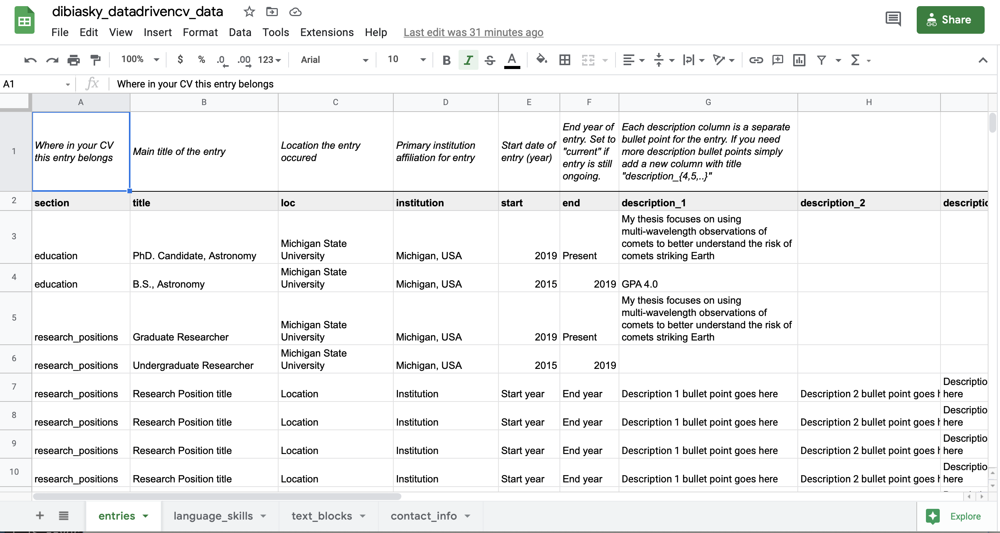
---
name: data-ddcv-2
class: left

# Step 1: Prepare your data in Google Sheets

.panelset[

.panel[.panel-name[entries]

#### `entries`

| Column          | Description                                                                                                                                                             |
| --------------- | ----------------------------------------------------------------------------------------------------------------------------------------------------------------------- |
| `section`       | Where in your CV this entry belongs                                                                                                                                     |
| `title`         | Main title of the entry                                                                                                                                                 |
| `loc`           | Location the entry occured                                                                                                                                              |
| `institution`   | Primary institution affiliation for entry                                                                                                                               |
| `start`         | Start date of entry (year). Can be left blank for single point events like a manuscript.                                                                                |
| `end`           | End year of entry. Set to “current” if entry is still ongoing.                                                                                                          |
| `description_*` | Each description column is a separate bullet point for the entry. If you need more description bullet points simply add a new column with title “description\_{4,5,..}” |

]

.panel[.panel-name[language_skills]
#### `language_skills`

| Column  | Description                     |
| ------- | ------------------------------- |
| `skill` | Name of language                |
| `level` | Relative numeric level of skill |

]

.panel[.panel-name[`text_blocks`]

#### `text_blocks`

| Column | Description                                           |
| ------ | ----------------------------------------------------- |
| `loc`  | Id used for finding text block                        |
| `text` | Contents of text block. Supports markdown formatting. |

]


.panel[.panel-name[contact_info]
#### `contact_info`

| Column    | Description                                                 |
| --------- | ----------------------------------------------------------- |
| `loc`     | Id of contact section                                       |
| `icon`    | Icon used from font-awesome 4 to label this contact section |
| `contact` | The actual value written for the contact entry              |

]

]

.footnote[
Click [here](https://docs.google.com/spreadsheets/d/1yCYKiTDbfYYUQYuNM304DwhUqTe4Zv-QxxfLoWPQmtY/) to view the example data used in the workshop today. *Source: click [here](http://nickstrayer.me/datadrivencv/) for more on the `datadrivencv` data requirements.*
]

---
name: google-tips
class: inverse, center, middle

# `r fontawesome::fa("lightbulb")` Some tips:

--

   ### `r fontawesome::fa("check-square")` Make sure your google sheets document is not .xlsx (i.e. if you import an excel document to Google)

--

  ### `r fontawesome::fa("check-square")` Make sure you your google sheets is public and share the link with anyone ("Editor option")

--

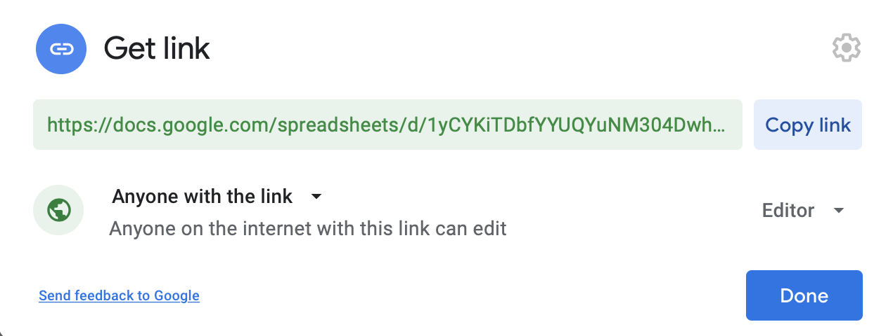(height="5px" width="10px")

---
name: install-ddcv

# Step 2: Start building your CV in `datadrivencv`

Install the `datadrivencv` package
```{r eval=F}
install.packages("datadrivencv")
```

--

If you get an error, download the development version. Make sure you install `devtools`

--

```{r eval=F}
install.packages("devtools")
devtools::install_github("nstrayer/datadrivencv")
```

--

With my version of R (4.1.2) I also had to install a specific version of the icons package

[*See github issue #57*](https://github.com/nstrayer/datadrivencv/issues/57), *this may be updated at a later date and may be unnecessary*

--
```{r eval=F}
install.packages("remotes")
remotes::install_github('mitchelloharawild/icons@v0.1.0')
```

---
name: new-ddcv-1

# Step 2: Start building your CV in `datadrivencv`

--

Load the library

--

```{r echo=T, eval=F}
library(datadrivencv)
```

--

Use the `use_datadriven_cv` function to create your CV .Rmd file

--

```{r eval=F}
datadrivencv::use_datadriven_cv(
  full_name = "Kate Dibiasky",
  data_location = "https://docs.google.com/spreadsheets/d/1yCYKiTDbfYYUQYuNM304DwhUqTe4Zv-QxxfLoWPQmtY/",
  pdf_location = "https://github.com/shaziaruybal/automate-cv-rmd/kate_dibiasky_datadrivencv.pdf",
  html_location = "shaziaruybal.github.io/automate-cv-rmd/kate_dibiasky_datadrivencv.html",
  source_location = "https://github.com/shaziaruybal/automate-cv-rmd/")
)
```

.footnote[
*If you've never heard of the `here` package I **highly** recommend it! [More info here](https://here.r-lib.org)*
]

---
name: new-ddcv-2

# Step 2: Start building your CV in `datadrivencv`

.left-column[
### You should now see the following files created in your directory:

]

.right-column[
| File                      | Description                                                                                                                                                                                                                                                                            |
| ------------------------- | -------------------------------------------------------------------------------------------------------------------------------------------------------------------------------------------------------------------------------------------------------------------------------------- |
| `cv.rmd`                  | An RMarkdown file with various sections filled in. Edit this to fit your personal needs.                                                                                                                                                                                               |
| `dd_cv.css`               | A custom set of CSS styles that build on the default `Pagedown` “resume” template. Again, edit these as desired.                                                                                                                                                                       |
| `render_cv.r`             | Use this script to build your CV in both PDF and HTML at the same time.                                                                                                                                                                                                                |
| `cv_printing_functions.r` | A series of functions that perform the dirty work of turning your spreadsheet data into markdown/html and making that output work for PDF printing. E.g. Replacing markdown links with superscripts and a links section, tweaking the CSS to account for chrome printing quirks, etc.. |

]

.footnote[
*Source: click [here](http://nickstrayer.me/datadrivencv/) for more on the `datadrivencv` package.*
]
---
class: inverse
# `r fontawesome::fa("x-ray")` The anatomy of the cv.rmd: Aside 

.pull-left[
If you populated the `contact_info` and `language_skills` sections in your google sheets, they will appear on the right margin of the CV document. 
```{r eval=F}
Aside 
================================================================================ 
  
Contact {#contact}
--------------------------------------------------------------------------------

Language Skills {#skills}
--------------------------------------------------------------------------------

Disclaimer {#disclaimer}
--------------------------------------------------------------------------------
```
]

.pull-right[


]

---
class: inverse

# `r fontawesome::fa("x-ray")` The anatomy of the cv.rmd: Main 

.pull-left[
The sections in your `entries` google sheet  will appear on the CV timeline on the left.
```{r eval=F}
Main
================================================================================
Kate Dibiasky {#title}
--------------------------------------------------------------------------------
Education {data-icon=graduation-cap data-concise=true}
--------------------------------------------------------------------------------
Research Experience {data-icon=laptop}
--------------------------------------------------------------------------------
Industry Experience {data-icon=suitcase}
--------------------------------------------------------------------------------
Teaching Experience {data-icon=chalkboard-teacher}
--------------------------------------------------------------------------------
Selected Data Science Writing {data-icon=chart-line}
--------------------------------------------------------------------------------
Selected Press (About)  {data-icon=newspaper}
--------------------------------------------------------------------------------
Selected Press (By)  {data-icon=newspaper}
--------------------------------------------------------------------------------
Selected Publications, Posters, and Talks {data-icon=book}
--------------------------------------------------------------------------------
```
]

.pull-right[

]

---

class: inverse

# `r fontawesome::fa("x-ray")` The anatomy of the cv.rmd: ::aside:: 

.pull-left[
If you populated the `text_blocks` google sheet, it will appear under your name in the case of `intro` and wherever there is an "aside" block in a given section, e.g. industry experience.
```{r eval=F}
Main
================================================================================
Industry Experience {data-icon=suitcase}
--------------------------------------------------------------------------------

::: aside

:::
```
]

.pull-right[

]
---

# Step 4: Final checks `r fontawesome::fa("check-square")`

.panelset.sideways[

.panel[.panel-name[Change CV image]

To change the image, edit the following code in the Aside section:

```{r eval=F}
# Build interactive network of positions colored by section 
# and connected if they occurred in the same year 
datadrivencv::build_network_logo(CV$entries_data) #<<
```

E.g.

```{r eval=F}

```


]

.panel[.panel-name[Edit cv.rmd]

### Remember the anatomy of the cv.rmd? 

Make sure you comment out any section that you don't want from the default template. To comment out code in HTML you need to use `<!---->` in between code lines, like so: 

```{r eval=F}
<!-- Teaching Experience {data-icon=chalkboard-teacher} -->
<!-- -------------------------------------------------------------------------------- -->

<!-- ::: aside -->
<!-- ```{r} -->
<!-- CV %<>% print_text_block('teaching_experience_aside') -->
<!-- ``` -->
<!-- ::: -->
```

**`r fontawesome::fa("lightbulb")` TIP**: Use the menu option `File Code -> Comment/Uncomment Lines` or ⇧+⌘+C to comment out several lines of code at once

]

.panel[.panel-name[Edit source code url]

If you want to link the source code to your CV repository make sure you update the URL, otherwise you can comment out those lines so they do not appear in your final CV document.
```{r eval=F}
Disclaimer {#disclaimer}
--------------------------------------------------------------------------------

Made with the R package [**pagedown**](https://github.com/rstudio/pagedown). 

The source code is available [on github.com/nstrayer/cv](https://github.com/nstrayer/cv). #<<

Last updated on `r Sys.Date()`.
```

Our code:
```{r eval=F}

Disclaimer {#disclaimer}
--------------------------------------------------------------------------------

Made with the R package [**pagedown**](https://github.com/rstudio/pagedown). 

The source code is available on [GitHub](https://github.com/shaziaruybal/automate-cv-rmd/).

Last updated on `r Sys.Date()`.
```

]

.panel[.panel-name[Output]
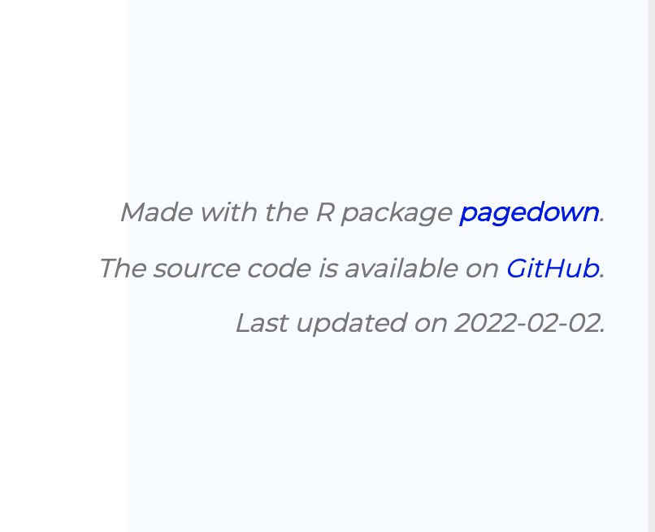

]

.panel[.panel-name[Modify cv_printing_functions.R]

In the current `datadrivencv` package version you need to manually edit the `cv_printing_functions.R` to update a function in the new `googlesheets4` package. For more information, see [github issue #68](https://github.com/nstrayer/datadrivencv/issues/68). 

Edit line 32 in the `cv_printing_functions.R` from:
```{r eval=F}
      googlesheets4::sheets_deauth() 
```

to:
```{r eval=F}
      googlesheets4::gs4_deauth() #<<
```

]
]


---
class: inverse, right, middle

.pull-left[
# Ready, set, KNIT! 

`File -> Knit Document` or click the `knit` button 🧶
```{r echo=F, eval=T, out.width="45%"}
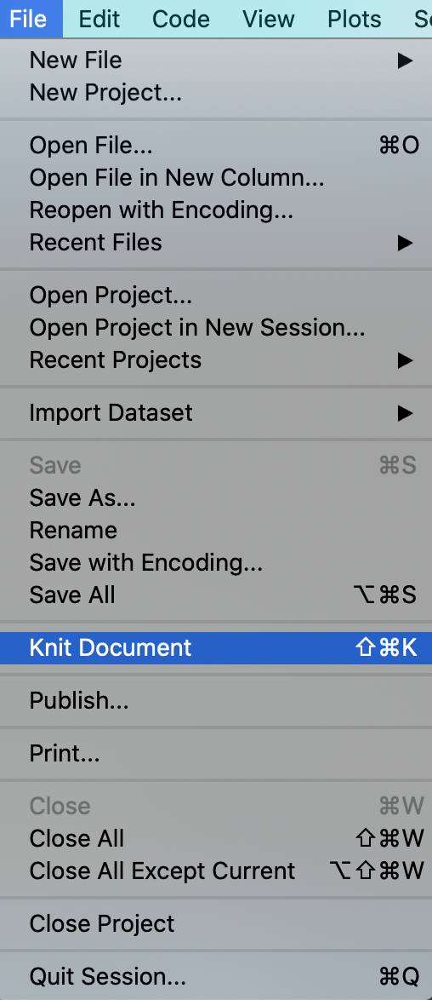
```
]

.pull-right[
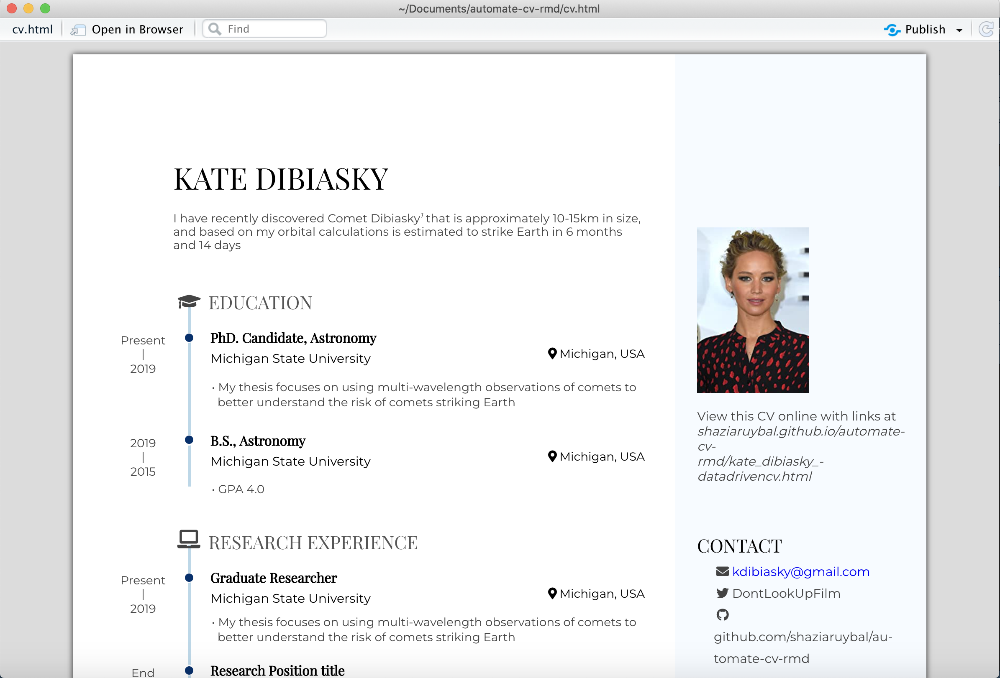
]

---
class: inverse
# But actually, `datadrivencv` has a nice script to build both HTML and PDF!

--

Change the output filenames if you want in `render_cv.r`
```{r eval=F}
# Knit the HTML version
rmarkdown::render("cv.rmd",
                  params = list(pdf_mode = FALSE),
                  output_file = "cv.html") #<<

# Knit the PDF version to temporary html location
tmp_html_cv_loc <- fs::file_temp(ext = ".html")
rmarkdown::render("cv.rmd",
                  params = list(pdf_mode = TRUE),
                  output_file = tmp_html_cv_loc)

# Convert to PDF using Pagedown
pagedown::chrome_print(input = tmp_html_cv_loc,
                       output = "cv.pdf") #<<
```

---
class: middle, left
background-image: url(img/kate_ddcv.png)
background-size: contain

.left-column[
# And, VOILA! `r fontawesome::fa("magic")`

`r fontawesome::fa("github")` To view the `datadrivencv` .Rmd file, click [here](https://github.com/shaziaruybal/automate-cv-rmd/blob/main/cv.rmd).
`r fontawesome::fa("download")` Download Kate's CV [here](https://github.com/shaziaruybal/automate-cv-rmd/raw/main/kate_dibiasky_datadrivencv.pdf)
]

---
# Some more `datadrivencv` resources


- [Sciencificity's Blog: {datadrivencv} of the ultimate (read as 'best') troublemaker.](https://sciencificity-blog.netlify.app/posts/2021-04-16-datadrivencv-of-the-best-troublemaker/) 

- Free Code Camp Talk: Making A Data Driven CV With RMarkdown by Bryan Jenks, watch at [`r fontawesome::fa("youtube")`](https://www.youtube.com/watch?v=cMlRAiQUdD8)

- [How to make your resume/CV in R by Keana Richards](https://www.keanarichards.com/2020/10/18/how-to-make-your-resume-cv-in-r/)


.footnote[*Not an exhuastive list*]

---
class: left, center

# `r fontawesome::fa("clipboard")` Recap

.left-column[

]

.right-column[
.left[
## `r fontawesome::fa("file-excel")` Prepare your data in .xlsx

## `r fontawesome::fa("upload")` Load CV data + `readExcelSheets`

## `r fontawesome::fa("code")` Modify your `.rmd` 

## `r fontawesome::fa("magic")` Magic with `vitae::detailed_entries()`
]]

---
class: left, center

# `r fontawesome::fa("clipboard")` Recap

.left-column[

]

.right-column[
.left[
## `r fontawesome::fa("google")` Prepare your data in Google sheets

## `r fontawesome::fa("upload")` Load CV data + `datadrivencv::use_datadriven_cv()`

## `r fontawesome::fa("code")` Modify your `.rmd` 

## `r fontawesome::fa("magic")` Render `render_cv.r`
]]

---
class: inverse, middle, center

# Easy as 1, 2, `knit`! 🧶

---
# Acknowledgments

- Nick Strayer for `datadrivencv`
- Yihui Xie and Romain Lesur for `pagedown`
- Mitchell O'Hara-Wild and Rob Hyndman for `vitae`

These slides were created using the R packages:  
[**xaringan**](https://github.com/yihui/xaringan), 
[gadenbuie/xaringanthemer](https://github.com/gadenbuie/xaringanthemer), 
[gadenbuie/xaringanExtra](https://github.com/gadenbuie/xaringanExtra) 
[*R-Ladies theme for xaringan*](https://github.com/yihui/xaringan/blob/master/inst/rmarkdown/templates/xaringan/resources/rladies.css)

---
name: contact
class: middle, center, inverse

### Shazia Ruybal-Pesántez 


### Postdoctoral Research Scientist & R-Ladies Melbourne President
#### Get in touch 💜

[`r fa(name = "github")` @shaziaruybal](http://github.com/shaziaruybal)  
[`r fa(name = "twitter")` @DrShaziaRuybal](http://twitter.com/DrShaziaRuybal)  
[`r fa(name = "link")` shaziaruybal.com](https://shaziaruybal.com)

.footnote[
[`r fontawesome::fa("image")` Slides](https://shaziaruybal.github.io/automate-cv-rmd/)  
[`r icon::fa("youtube")` Recording](https://youtu.be/Fc1RwRskk08)   
[`r fontawesome::fa("github")` Workshop materials](https://github.com/shaziaruybal/automate-cv-rmd)
]
